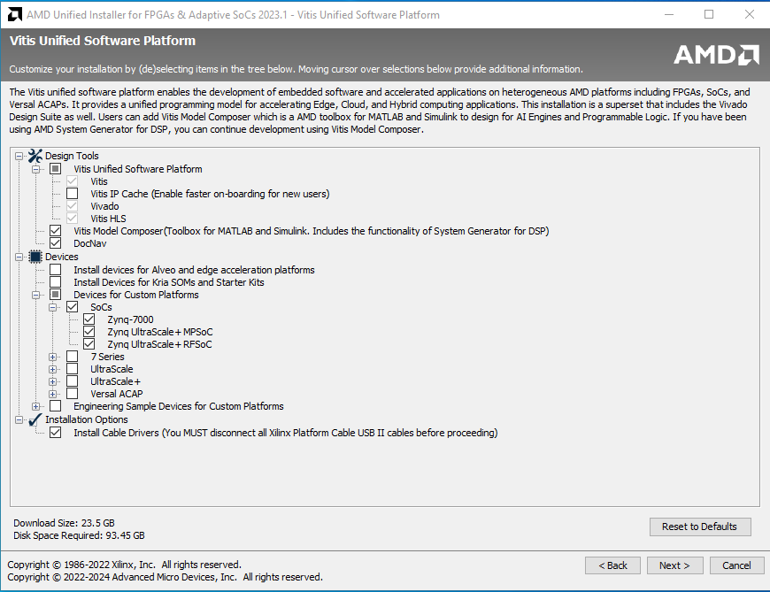

Installation de l’environnement

Stage Hyperviseur FPGA 2024

Février 2024

Novasys Ingénierie

Emeric DU GARDIN

# **Table des matières**

[I. Compte et installeur
[2](#compte-et-installeur)](#compte-et-installeur)

[II. Installation [3](#installation)](#installation)

# Compte et installeur

1.  Aller sur <https://www.xilinx.com/support/download.html> .

2.  Choisir la version 2023.1 ML édition.

1.  Créer un compte AMD. Le compte sera redemandé à l’installation.

# Installation 

1.  Lancer l’installeur et rentrer le compte AMD précédemment
    créé.

2.  Dans le choix des produits, sélectionner Vitis.
    

3.  Sélectionner les fonctionnalités necessaire.
    

4.  Une fois l’installation terminé, suivre le guide de prise en main
    d’Etienne CHANUDET et Aurélien TUBY, stage hyperviseur FPGA 2023.
